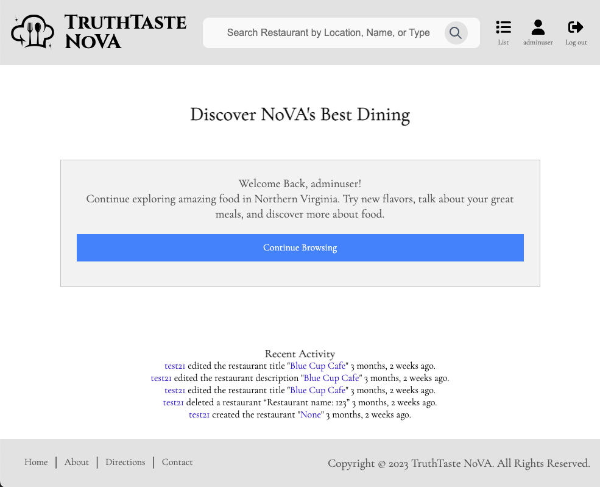
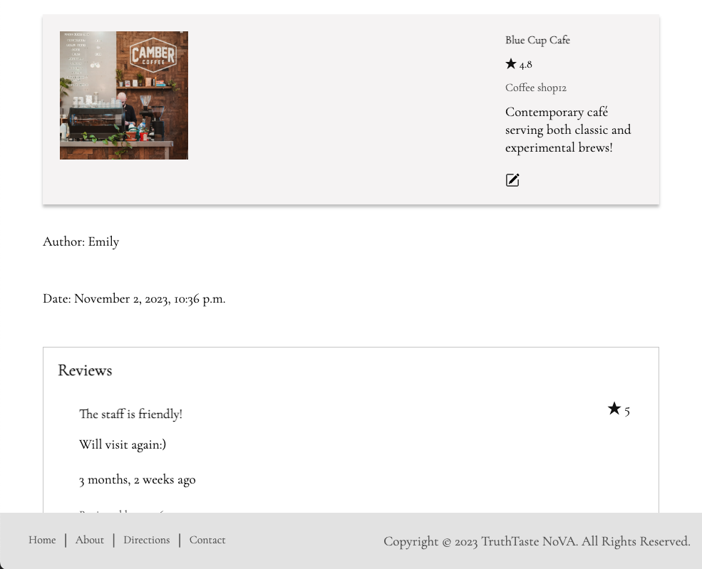
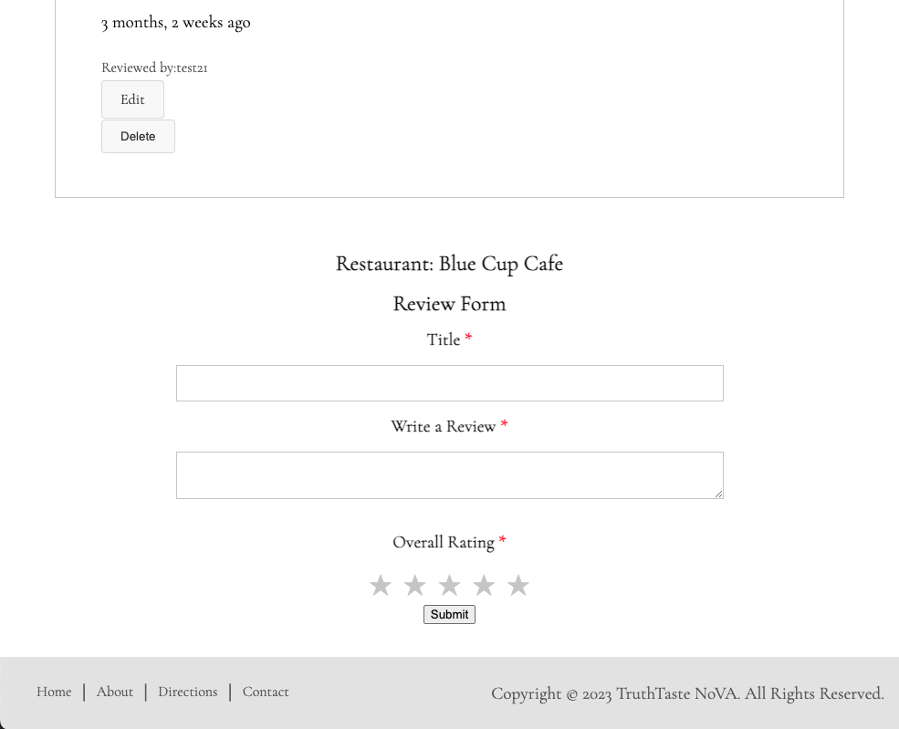
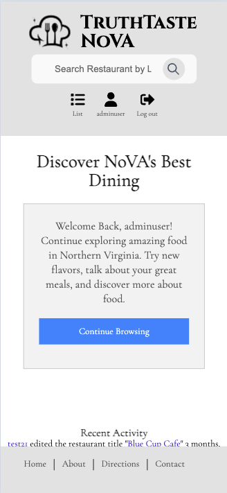
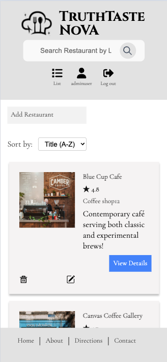
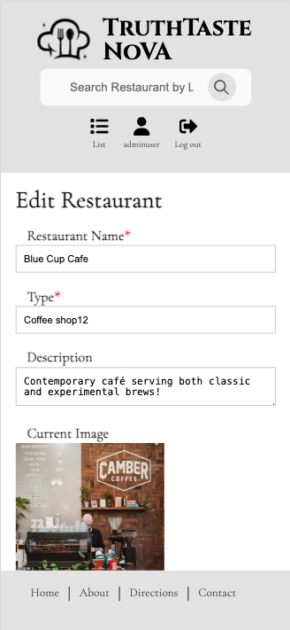

## TruthTaste NoVA

### Introduction
TruthTaste NoVA is a restaurant review website, dedicated to bringing a new way for travelers to
explore their dining experience in Northern Virginia. All pages on TruthTaste NoVA are designed with a 
responsive layout, ensuring an optimal viewing and interaction experience across a wide range of devices.

### Target audience
Tourists seeking trustworthy restaurant reviews in Northern Virginia.

### Main User Actions
The user will be able to start discovering restaurants with an account or without logging in as a
guest. If the user has a user account, they can access extra functions, including recording the
restaurants they have visited, saving restaurants to a list, and checking the above records on their
personal page. If they don’t have an account, the top-right corner will display a login/ sign-up
option and a prompt message to remind them to create an account.

### Key pages:

* Home Page 

* Restaurant List Page 

* Restaurant Detail Page 

* Create Restaurant Page 

* Edit Restaurant Page

* Profile Page

* Samples of Mobile view 

